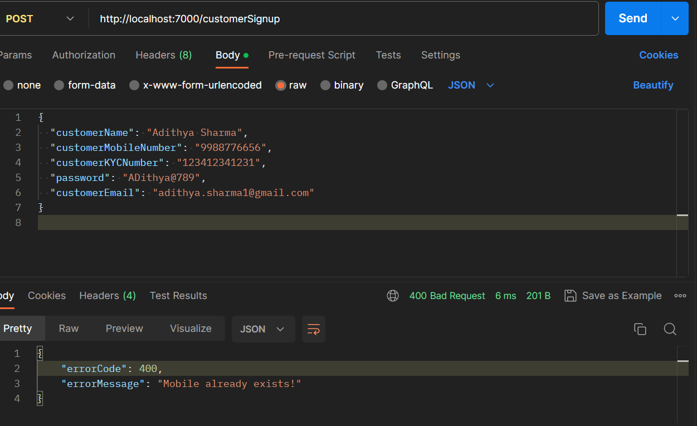

# ePay Payments Application
##### ePay is a new app being made for payments. It lets customers have multiple accounts and makes banking with debit cards and UPI easy. In the future, it will have features like EMI, buy now pay later, and credit card options. It can also connect with other online stores to process payments.
# ---------------------------------------

# ---------------------------------------
#API Endpoint
###[POST]http://localhost:7000/customerSignup

# ---------------------------------------
## Status: 
#### Under developing
## Developer: 
#### Naveen Prasanna
## Version: 
###### v1.0
###### ts-V0.5